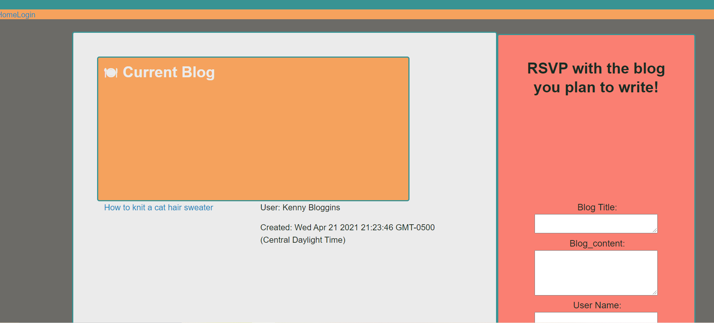

# Tech-Blog

## Description 
The Tech-blog log application allows users to log in, create blog notes, and save notes. Timestamp included with blog entries. Deployed on Heroku,using the Express,MYSQL, Sequelize, Express Handlebars packages. 
 
## Table of Contents
* [Installation](#installation)
* [Usage](#usage)
* [Contributing](#contributing)
* [Questions](#questions)

 Link to deployed app on [Heroku](https://murmuring-springs-96477.herokuapp.com/)

## Installation 
The user should install Express, MYSQL, Sequelize, Express Handlebars node packages. 

## Usage 
Prompts for user input in login fields, and creates blog posts within site.

## Contributing 
Users should refer to the Installation Section. 

## Questions
 Any questions ? Email me at kelsie51@hotmail.com, Github URL for project at https://github.com/kelsie51/Tech-Blog

